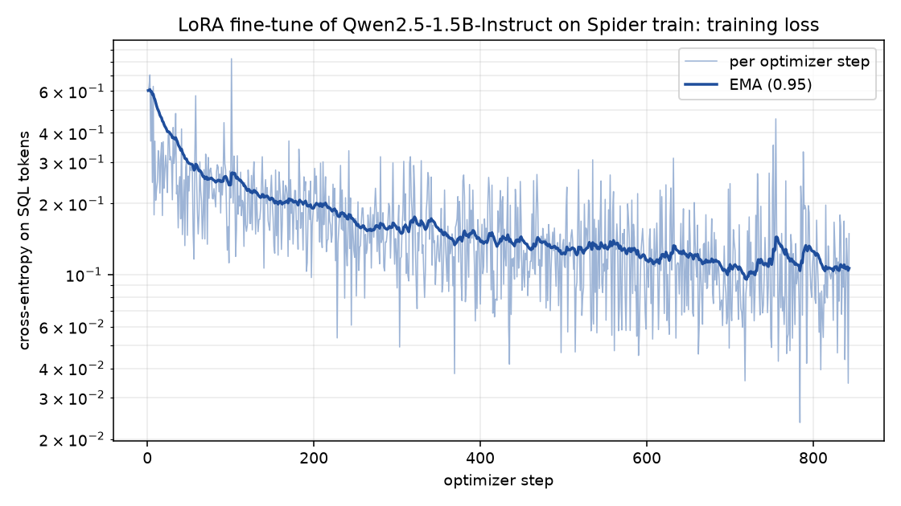

# text2sql-lora

LoRA fine-tune of Qwen2.5-1.5B-Instruct for text-to-SQL, scored by **execution match** on
the Spider benchmark. Trained and evaluated entirely on one 8 GB laptop GPU (RTX 4060).

## Results

<!-- results:start -->
Slice: `dev200` (200 questions scored).

| Model | Execution accuracy | 95% CI | Correct | p50 latency | p95 latency |
| --- | --- | --- | --- | --- | --- |
| Qwen2.5-1.5B-Instruct, zero-shot (transformers fp16) | **47.5%** | 40.7% to 54.4% | 95/200 | 2.56 s | 5.19 s |
| Qwen2.5-7B-Instruct, zero-shot (Ollama Q4_K_M) | **70.0%** | 63.3% to 75.9% | 140/200 | 0.70 s | 1.83 s |
| Qwen2.5-1.5B-Instruct + LoRA (this repo, transformers fp16) | **61.5%** | 54.6% to 68.0% | 123/200 | 1.71 s | 3.76 s |

Paired comparisons on the same questions:

| A vs B | Accuracy difference (A - B) | Bootstrap 95% CI | Only A right | Only B right | McNemar p |
| --- | --- | --- | --- | --- | --- |
| Qwen2.5-1.5B-Instruct + LoRA (this repo, transformers fp16) vs Qwen2.5-1.5B-Instruct, zero-shot (transformers fp16) | +14.0 pts | +6.5 to +22.0 pts | 47 | 19 | 7.6e-04 |
| Qwen2.5-1.5B-Instruct + LoRA (this repo, transformers fp16) vs Qwen2.5-7B-Instruct, zero-shot (Ollama Q4_K_M) | -8.5 pts | -16.0 to -1.0 pts | 21 | 38 | 0.036 |
<!-- results:end -->

In short: one epoch of LoRA on a single laptop GPU lifts the 1.5B model clearly above its
own zero-shot baseline (the paired interval excludes zero), and it still trails the
zero-shot 7B model. The fine-tune narrows the gap to a model about five times its size;
it does not close it.

How to read this:

- **Execution accuracy**: the predicted SQL and the gold SQL are both run against the real
  SQLite database and their result sets compared. A query that returns the right rows
  counts as correct however it is written; a query that fails to execute counts as wrong.
- **95% CI** is a Wilson interval on that proportion. The paired rows use an exact
  McNemar test and a paired bootstrap (10,000 resamples) on the per-question outcomes.
- **Latency** is per-question generation time, end to end, after one warm-up call. The
  two 1.5B rows run on the same stack (transformers, fp16, greedy, one question at a
  time) and are directly comparable. The 7B row runs on Ollama (GGUF Q4_K_M, with prompt
  prefix reuse between consecutive questions on the same schema), so its latency
  describes that serving stack, not the model size alone.
- All three rows use the same prompt, the same questions and the same scorer. The dev
  databases never appear in training.

Every number in this README is generated from the files in [`results/`](results/) by
`scripts/make_table.py`. Nothing is estimated or quoted from elsewhere.

## Training

<!-- training:start -->
- Base model: `Qwen/Qwen2.5-1.5B-Instruct`, fp16 weights, no quantisation. GPU: NVIDIA GeForce RTX 4060 Laptop GPU.
- LoRA rank 16, alpha 32, dropout 0.05, on q_proj, k_proj, v_proj, o_proj, gate_proj, up_proj, down_proj: 18,464,768 trainable parameters (1.18% of 1,562,179,072).
- Data: Spider `train_spider.json`, 6,394 examples after dropping 606 longer than 768 tokens.
- Run: 6,394 examples seen (1.00 epochs), 843 optimizer steps, 29.3 minutes wall-clock, 3.6 examples/s, peak VRAM 7.08 GB (stopped: completed).
- Loss on SQL tokens: 0.603 at step 1, 0.107 mean over the last 20 steps.
- Optimiser: AdamW, peak learning rate 0.0002, cosine decay, 4 batches per step, up to 800 padded tokens per batch.
<!-- training:end -->



This is the second training run. The first was lost to a hardware shutdown before
checkpointing existed; its partial loss log is kept as
`results/train_log_run1_interrupted.jsonl` and the incident is written up in
[HANDOFF.md](HANDOFF.md). Training now checkpoints every 5 minutes and resumes with
`--resume`.

## Try it

A local command-line demo (not a hosted app): pick a Spider database, ask a question,
see the SQL the fine-tuned model writes and the rows it returns.

```bash
uv run python scripts/ask.py --db concert_singer "Which country has the most singers, and how many?"
```

## How it works

```
question + schema read from the SQLite file
        |
   one shared prompt  ->  model (transformers or Ollama)  ->  SQL extracted from reply
        |                                                          |
        |                         predictions/<run>.jsonl  <-------+  (cached per question)
        v
   exec_eval: run gold and predicted SQL read-only, with a timeout, on the live database
        |
   compare result sets  ->  results/<run>__<slice>.json  ->  README table
```

- `t2sql/exec_eval.py`: the scorer. Databases are opened read-only and every query has a
  timeout, because predicted SQL is untrusted. Row order only matters when the gold query
  has `ORDER BY`; column order is ignored; duplicates count.
- `t2sql/prompt.py`: the one prompt every model gets, and SQL extraction from the reply.
- `t2sql/backends.py`: transformers (base, or base + merged LoRA) and Ollama generators.
- `t2sql/stats.py`: exact McNemar and paired bootstrap, standard library only.
- `scripts/train_lora.py`: the fine-tune. fp16 base weights, LoRA weights in fp32, loss on
  the SQL tokens only, batches packed by token count to stay inside 8 GB.

## Reproduce

Requires an NVIDIA GPU with 8 GB VRAM, [uv](https://docs.astral.sh/uv/) and
[Ollama](https://ollama.com).

```bash
uv sync                                   # Python 3.12 env with CUDA PyTorch
# Spider with its SQLite databases -> data/spider_data/
curl -L -o data/spider_data.zip https://huggingface.co/datasets/HAL-9001/spider-databases/resolve/main/spider_data.zip
unzip data/spider_data.zip -d data
ollama pull qwen2.5:7b

uv run python scripts/make_slice.py --n 200
uv run python scripts/evaluate.py --backend gold --name smoke_gold --limit 10      # must be 10/10
uv run python scripts/evaluate.py --backend hf --model Qwen/Qwen2.5-1.5B-Instruct --name qwen1.5b_zeroshot
uv run python scripts/evaluate.py --backend ollama --model qwen2.5:7b --name qwen7b_ollama_zeroshot
uv run python scripts/train_lora.py --epochs 1 --max-len 768 --max-tokens 800 --grad-accum 4 --resume
uv run python scripts/plot_loss.py
uv run python scripts/evaluate.py --backend hf --model Qwen/Qwen2.5-1.5B-Instruct \
    --adapter adapters/qwen1.5b-spider-lora --name qwen1.5b_lora
uv run python scripts/compare.py --pairs qwen1.5b_lora:qwen1.5b_zeroshot qwen1.5b_lora:qwen7b_ollama_zeroshot
uv run python scripts/make_table.py
uv run pytest -q                          # scorer and stats tests, no GPU needed
```

Raw model outputs for every scored question are committed under
[`predictions/`](predictions/), so the table can be re-scored without a GPU.

## Limitations

- Scored on a seeded slice of Spider dev, not the full set, unless the slice line above
  says otherwise. The confidence intervals show how much that costs.
- Execution match on a single database instance can accept a wrong query that happens to
  return the right rows. Spider's test-suite databases exist to tighten this; they are
  not used here.
- One training run, one seed. No hyperparameter search.
- Trained weights are not published; the adapter is rebuilt by the command above.

## Roadmap

Not started: GRPO reinforcement learning with execution rewards, synthetic
self-distillation, QLoRA at 7B, and a deployed (hosted) demo. Details and the decisions
log are in [HANDOFF.md](HANDOFF.md).

## Attribution

Spider: Yu et al., 2018, CC BY-SA 4.0. Base model: Qwen2.5-1.5B-Instruct (Alibaba Cloud,
Apache-2.0).
